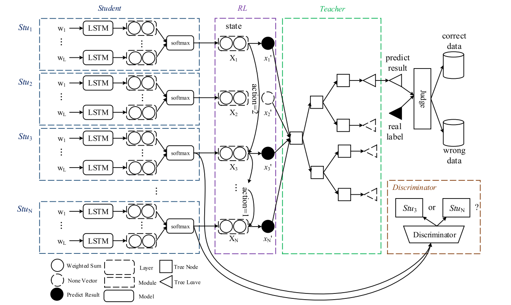
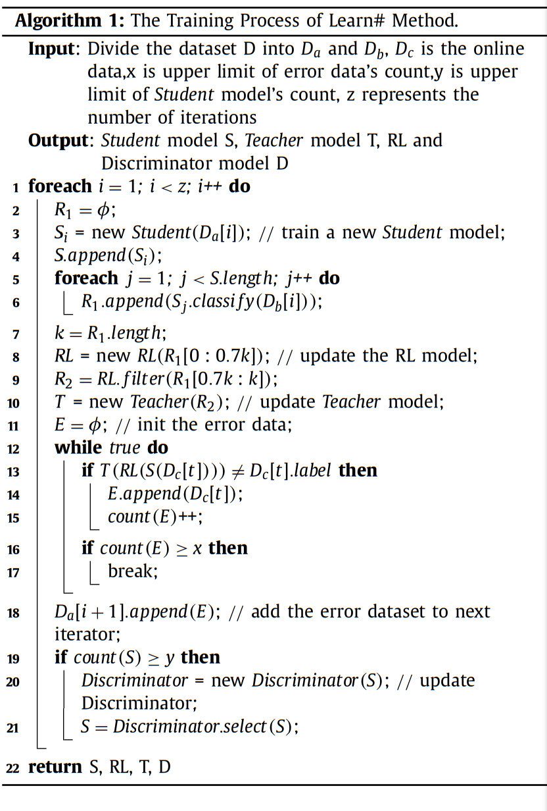

## :zap:A Novel incremental learning method for text classification:zap:

 Tensorflow implementation of: 

:fire: Text classification based on incremental learning :fire:

### :bookmark: introduction

 limitation of  text classification using deep learning:
1. deep learning models are trained in a batch learning setting with the entire training data. So it is cumbersome when used in a continual learning setting because storing previous text data is a memory expensive task
1. Second, it is difficult to obtain total sufficient labeled samples for text classification with deep learning at the beginning because the labeling cost is prohibitively expensive or they do not occur frequently enough to be collected
1. model performances highly depend on the distribution of the data samples. The distribution of the previous datasets might differ from that of the newly collected data, which might lead to overfitting.

to address thesee problems incremental learning is used.

benefits of inceremental learning:
1.when new samples are added, there is no need to retrain with all samples.

### :bookmark: method

this project consists of four components: Student model, a reinforcement learning (RL) module, a Teacher model, and a discriminator model.

#### Student model
Student models are deep learning models that are used to solve classification tasks. In this project, the pre-trained Bert model was utilized, followed by feeding the inputs to multilayer LSTM models. The input categories were then classified using softmax activation functions. The feature vectors of the text representations are captured in the vector of the last layer.

#### Reinforcement Learning Module
As student models can be considered as a sequence, the feature vectors that are obtained from the outputs of student models can also be considered as a sequence. This sequence forms the states in reinforcement learning. 

In this framework, the current state is represented as Xt, the next state is represented as Xt+1, and the action is represented as at. The transition dynamics T(Xt+1|Xt, at) map the prediction vector Xt at time t to another prediction vector Xt+1 at the next step (t + 1 <= N). 

The reward rt is determined by comparing the predicted result of the student model to the real label. If the predicted result matches the real category, the reward is 1; otherwise, it is -1.

To find an optimal policy, we employ DQN in the filter layer. We design a multilayer neural network to fit the Q values. The model's output determines the predicted action and decides which student model will be chosen next.

We save the prediction results for empirical playback and update the reinforcement learning model based on historical samples. The ultimate goal of reinforcement learning is to maximize the accuracy of the entire model's predictions. Once the model is trained, the prediction results of the student models can be input into the reinforcement learning model, until all the predictions are filtered. The filtered results of the predictions are then used for the teacher model. The RL module filters out excessive error results generated by the student models and enhances the learning effect. It ensures that the predictions of multiple student models are globally optimized.

#### Teacher Model
The Teacher model classifies the Student model’s output that has been selected by RL module and obtains the final classification results of the text. It performs as a secondary classification. Here we use the boosting trees model to solve theclassification task and obtain the category of the text.
The Teacher model serves as a global model to integrate the local results. On the one hand, it eventually overwrites local mis-
classification results. On the other hand, it is an easy-to-use and non-parametric classifier, does not require any assumptions on the
data and the amount of the input data is small, while the speed of calculation is repaid and the model’s performance is robust.

#### Discriminator Modelll

### :bookmark: train algorithm

